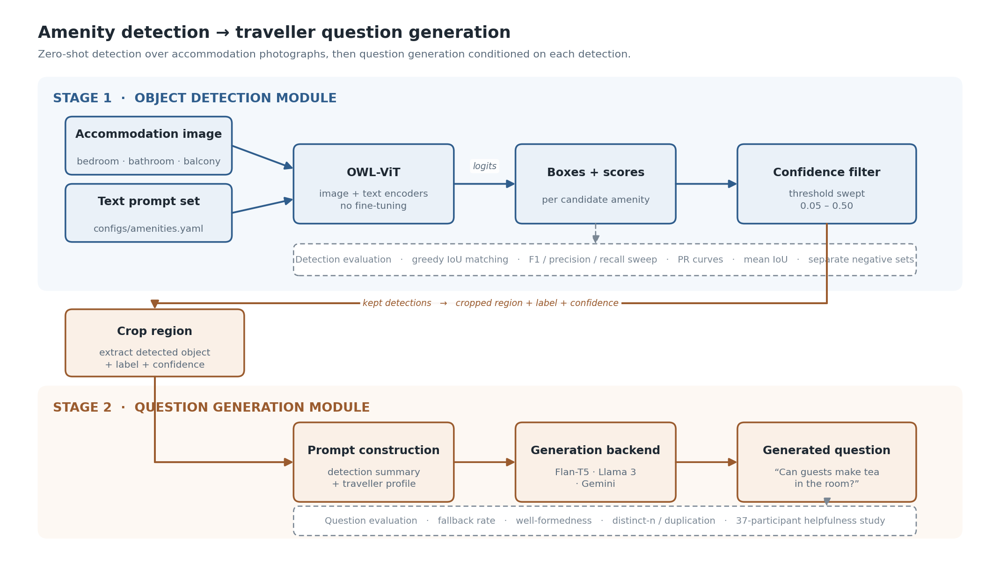
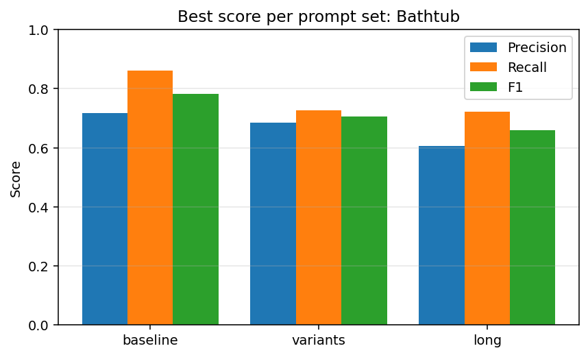
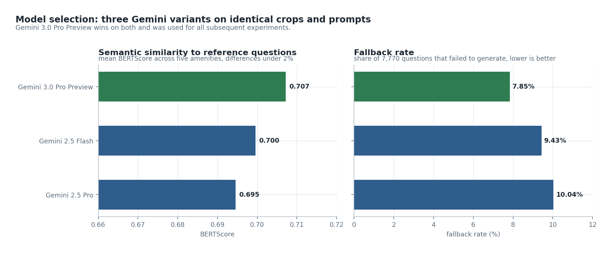
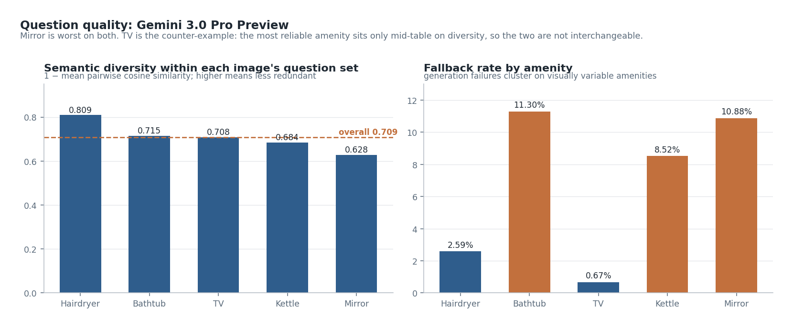
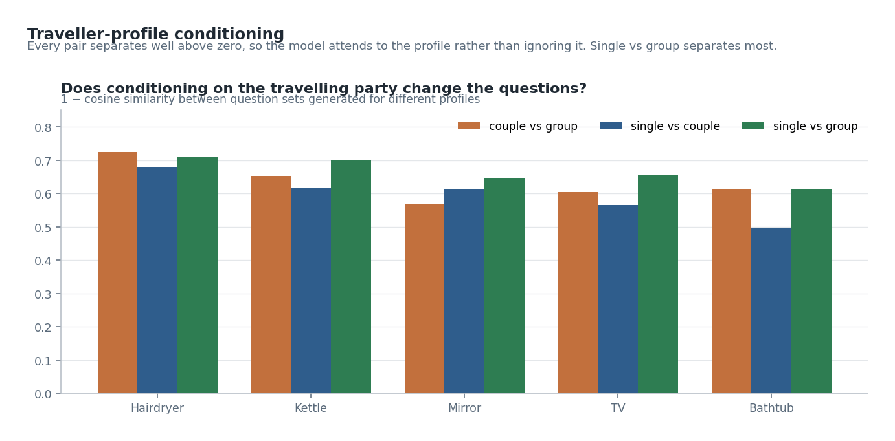

# Generating User-Relevant Queries from Detected Amenities in Accommodation Images

Master's thesis project (Industrial Informatics, 2026) building a two-stage
pipeline that looks at hotel photographs and produces the questions a traveller
would want answered before booking.

**Stage 1.** Zero-shot object detection finds amenities (bathtub, hairdryer,
kettle, mirror, TV) in accommodation photos using OWL-ViT, with no fine-tuning.
**Stage 2.** A language model turns each detection into a short,
decision-relevant question.

Evaluated on 1,531 test images, seven generation backends, and a 37-participant
user study. The images are **real accommodation listing photographs provided by
trivago N.V.**, hand-annotated for evaluation, with a small number of public
stock images in the TV set.



**Start here:** [`notebooks/`](notebooks/) walks the whole experiment end to end:
the data, the detector, the failure that shaped the project, and the user study.
All four render on GitHub with their outputs, so you can read them without
running anything.

**In a hurry?** The [defence presentation](docs/thesis_presentation.pdf)
(31 slides) covers the whole project visually and previews directly in GitHub.

<sub>**Scope.** This repository is a walkthrough of the method and its results,
not the production system. The full-scale runs used the industry collaborator's
internal infrastructure; that code and its configuration are not published. What
is here is the method reimplemented against public APIs, runnable over a small
committed image sample, reporting the **real measurements** from the original
runs.</sub>

---

## Results at a glance

Zero-shot detection, best F1 per amenity across a confidence sweep:

| Amenity | Best prompt | Conf | F1 | Precision | Recall | mIoU | Thesis F1 |
|:---|:---|---:|---:|---:|---:|---:|---:|
| TV | baseline | 0.05 | **0.832** | 0.885 | 0.785 | 0.849 | 0.836 |
| Bathtub | baseline | 0.05 | **0.783** | 0.718 | 0.861 | 0.777 | 0.790 |
| Hairdryer | variants | 0.15 | **0.778** | 0.827 | 0.735 | 0.762 | 0.808 |
| Kettle | electric | 0.05 | **0.696** | 0.735 | 0.662 | 0.783 | 0.705 |
| Mirror | baseline | 0.15 | **0.667** | 0.667 | 0.667 | 0.844 | 0.731 |

<sub>Regenerate this table from the committed data: `python scripts/build_results_table.py`</sub>

### The evaluation was wrong, and this is the corrected version

The last column is what the thesis reported. Those numbers came from a scorer
with a bug that I found while preparing this repository.

The original matching counted *predictions that overlapped something* rather than
*ground-truth boxes that were found*, so several boxes drawn on one bathtub
scored several true positives instead of one true positive and some duplicates.
There was also no non-maximum suppression anywhere in the pipeline, and OWL-ViT
emits near-duplicate boxes freely.

**The diagnostic is worth stealing:** `tp + fn` must equal the number of
ground-truth boxes at every threshold and for every prompt set, because ground
truth is a fixed property of the dataset. It did not. Mirror reported 420 against
285 annotated boxes. It now holds exactly for all five amenities, and
`tests/test_metrics.py::test_tp_plus_fn_equals_ground_truth` asserts it so the
bug cannot come back quietly.

What changed: class-agnostic NMS before scoring, then greedy one-to-one matching
in descending score order with each ground-truth box claimable once. `mIoU` rises
because it now averages over matched pairs rather than over every prediction
including false positives.

Four of five amenities move by less than 0.05. Mirror falls furthest, from 0.731
to 0.667, which fits: mirrors attract the most duplicate boxes, and they are the
amenity the thesis already identifies as hardest.

Specificity and the negative-set analysis were unaffected, because those count
images with any detection rather than matched pairs. Findings 3 and 4 never
touched this code path.

<sub>**Selection caveat.** Prompt set and confidence threshold were both chosen
from a sweep over the test split, so these are best-of-sweep figures and should
be read as an optimistic upper bound. The validation splits were too small to
select on (18 images for bathtub, 52 for mirror), which is why the full sweep is
published rather than a single tuned number.</sub>



---

## Four findings worth reading

**1. Richer prompts mostly did not help.** The intuition that an open-vocabulary
detector benefits from descriptive prompts ("white ceramic bathtub in hotel
bathroom") did not hold. The bare class name wins for bathtub, mirror and TV.
Hairdryer is the one clear case where a multi-synonym set helps, and kettle is a
tie inside the noise (`electric` 0.696 against `baseline` 0.692).

Long descriptive prompts were the **worst** option for every amenity, often by a
wide margin: 0.660 against 0.783 for bathtub, and 0.441 against 0.778 for
hairdryer.

<sub>The correction strengthened this finding rather than weakening it. The old
scorer inflated whichever prompt set produced the most boxes, which flattered the
multi-synonym sets specifically, so fixing it widened the gap in baseline's
favour.</sub>

**2. The optimal confidence threshold is far lower than any sensible default.**
Three of five amenities peak at 0.05 and the other two at 0.15, so every one sits
at or below half a conventional 0.3. These are small, frequently occluded objects
in cluttered rooms, and OWL-ViT is systematically underconfident about them.
Running with a conventional 0.3 threshold would have collapsed recall. The
trade-off is visible on the negative sets. The threshold that maximises F1 is
also the one with the weakest specificity.

**3. Text-only conditioning collapses into templates, and conditioning on the
image fixes it.** This is the project's most useful result. When the language
model receives only `label + confidence + prompt type`, that input is nearly
identical across detections, so the output is too. Passing the cropped detection
region to a multimodal model instead moves diversity by an order of magnitude:

| Backend | Conditioning | Distinct-2 | Duplicate rate | Most common output |
|:---|:---|---:|---:|:---|
| Flan-T5 Base | text | 0.007 | 98.1% | *"What is the name of the hotel amenity?"* × 592 |
| Flan-T5 Large | text | 0.005 | 98.9% | *"What is the name of the bathroom amenity?"* × 307 |
| Llama 3 70B | text | 0.011 | 97.6% | *"Does the room have a bathtub?"* × 429 |
| Llama 3 8B | text | 0.035 | 80.3% | *"Is the bathtub separate from the shower?"* × 130 |
| Gemini 3.0 Pro Preview | **vision** | **0.273** | **4.7%** | *"Is there enough counter space for both partners' toiletries?"* × 55 |

<sub>Bathtub detections. Regenerate: `python scripts/build_finding3_table.py`</sub>

**Fluency metrics hide the collapse completely.** Every text-only backend scores
0% fallback and 100% well-formedness while emitting the same handful of
sentences. Well-formedness measures whether a question is shaped like a question;
it cannot see that it is the *same* question 592 times. Any evaluation of
generated questions needs a diversity term or it will report success here.

They miss relevance too. Neither metric checks that a question is about the
amenity that was detected, and 5.8% of the kettle questions mention baths, tubs
or showers. Diversity catches repetition, not drift, so a complete evaluation
needs a third term for on-topic-ness that this project does not have.

The vision comparison is size-matched: distinct-n falls as a corpus grows, so the
2,484 vision questions are subsampled to 1,003 to match the text-only row count,
averaged over 20 draws (range 0.269–0.281).

This is not a clean ablation. The vision model differs from the text-only
backends in capability as well as conditioning, so it shows the combination
helps, not the crop alone. That is why the project did not stop here, and
Finding 4 is the work that followed.

---

**4. Picking the vision model, and what it does well.** Once conditioning moved to
the image, three Gemini variants were compared on identical crops and prompts,
scored by BERTScore against 25 reference questions.



The spread is under 2%, so model choice barely matters here, which is itself worth
knowing. Gemini 3.0 Pro Preview edges both and was used for everything downstream.



Two things stand out. **Semantic diversity**, measured *within* each image's
question set as 1 − mean pairwise cosine similarity, averages 0.709 across
amenities, ranging from 0.628 for mirror to 0.809 for hairdryer. So the model is
not asking the same thing five times about one photo.

**Reliability is amenity-dependent, and the pattern is interpretable.** TV fails
on 0.67% of questions; bathtub on 11.30%, mirror on 10.88%. Televisions are
standardised rectangles; bathtubs and mirrors vary in shape, framing and
reflection. Generation robustness tracks visual regularity, which argues for
per-amenity prompt work rather than a global model change.



**Traveller-profile conditioning genuinely lands.** Question sets generated for a
solo traveller, a couple and a group separate from one another by 0.50 to 0.73
cosine distance. The model attends to the profile rather than politely ignoring
it. Single-vs-group separates most on average (0.664), though for bathtub and
hairdryer it is couple-vs-group that pulls furthest apart.

<sub>Regenerate all three: `python scripts/build_generation_figures.py`</sub>

---

## User study: 37 participants, 75 questions

Overall mean helpfulness **3.36 / 5**. 87% of questions cleared "moderately
helpful"; only 37% reached 3.5+.

The between-amenity spread was small (3.22–3.45). The revealing variance was
*within* amenities. Participants rated questions about concrete booking factors
highly ("Is this a Smart TV that allows guests to log into their own streaming
accounts?", 3.92) and questions about visual ambiguity poorly ("Is the white
border a digital display effect or a physical part of the screen?", 2.22).

**Detection uncertainty and traveller relevance are different quantities.** A
system that generates questions about whatever the detector found ambiguous is
optimising the wrong objective.

Full breakdown, participant demographics, and study limitations:
[`docs/user_study_summary.md`](docs/user_study_summary.md). Per-amenity question
ratings are also on slides 19 and 25–28 of the
[defence presentation](docs/thesis_presentation.pdf).

---

## Repository layout

```
configs/amenities.yaml     Prompt sets and thresholds (the only per-amenity difference)
src/
  config.py                Typed config loading
  detection/
    detector.py            OWL-ViT wrapper
    metrics.py             IoU matching, threshold sweeps, negative-set scoring
    plots.py               Figure generation
    run_detection.py       CLI entry point
  question_generation/
    prompts.py             Detection → prompt, traveller profiles, image cropping
    backends.py            Flan-T5 / Groq / Gemini / Gemini-vision behind one interface
    generate.py            CLI entry point
  evaluation/
    question_metrics.py    Fallback, well-formedness, distinct-n, duplication
notebooks/                 Four executed walkthroughs (outputs included)
data/sample/               46 real images + COCO annotations, so notebooks run
results/                   Detection CSVs, metrics, figures, generated questions
tests/                     pytest suite
scripts/                   Reproducibility helpers
docs/                      Dataset inventory, user study, architecture, defence deck
```

---

## Running it

```bash
git clone https://github.com/khan07t/MultiModal_Accommodation_Image_Query_Generation.git
cd MultiModal_Accommodation_Image_Query_Generation
pip install -r requirements.txt
```

Reproduce both published tables. No GPU, no dataset download, pandas only:

```bash
python scripts/build_results_table.py     # detection table
python scripts/build_finding3_table.py    # diversity table
```

The test suite needs the full `requirements.txt` (the detection tests use torch):

```bash
pytest tests/ -q                          # 29 tests
```

The notebooks are committed with their outputs, so reading them needs nothing.
To execute them, `pip install -r requirements-notebooks.txt`. They run on the
46-image sample under `data/sample/`, no dataset download needed. Notebook 02 has
a `RUN_LIVE_DETECTION` flag for running OWL-ViT yourself, off by default.

Re-score the committed detections against the committed sample, which needs no
dataset download:

```bash
python -m src.detection.run_detection --all --data-root data/sample \
    --skip-inference --out-root /tmp/sample-run
```

<sub>`--out-root` is required here. The committed detections span the full test
split, so scoring them against the 46-image sample gives sample-scale numbers,
and the run refuses to write those over the published results.</sub>

Full-scale detection and question generation are `src/detection/run_detection.py`
and `src/question_generation/generate.py`; both have `--help`. Generation reads
API keys from `GEMINI_API_KEY` / `GROQ_API_KEY`.

---

## Limitations

- **Reflective amenities are hard.** Mirrors remain the weakest class. Reflective
  surfaces read as windows or decorative elements. Amenity-specific prompt
  refinement, or limited context-aware adaptation, is the natural response.
- **Not every question is fully visually grounded.** A minority rely on
  assumptions the image alone cannot settle. Tighter prompt tuning, and
  discouraging patterns weakly linked to the detected amenity, would narrow this.
- **The user study was exploratory in scale, and outside a booking interface.**
  37 participants rating questions in isolation is enough to establish perceived
  usefulness, not real-world impact. A larger study inside a realistic interface,
  ideally A/B tested in a live system, would be the stronger evidence.

## Where this would go next

This was master's thesis work, so it stops at the point where the research
question is answered. The natural continuation is productisation rather than
more experiments.

That means integrating the pipeline into a real backend and testing the use case
against a full accommodation inventory rather than a curated evaluation set,
which is also what would show whether the detection scores generalise beyond the
five amenities studied here. Generation would then move onto whichever model best
fits inside the platform's own infrastructure, evaluated in place rather than
against a fixed reference set.

Two extensions follow naturally from the thesis: conditioning on real user
preference signals instead of assumed traveller profiles, and joining generated
questions to existing platform data (amenity metadata, descriptions, reviews)
so a question can be answered as well as asked.

---

## Acknowledgements

This thesis was carried out in collaboration with **trivago N.V.**, whose problem
framing, domain guidance, and product context shaped the work.

**The accommodation images were provided by trivago N.V.** and are reproduced
with permission. They remain the property of trivago N.V. A small number of
images in the TV set are public stock photography rather than trivago listings.
See [`data/sample/ATTRIBUTION.md`](data/sample/ATTRIBUTION.md) and
[`docs/dataset_inventory.md`](docs/dataset_inventory.md).

The full-scale experiments ran on internal infrastructure provided for the
collaboration. That code and configuration are not published here; this
repository reimplements the method against public APIs and reports the results
from the original runs.

Academic supervision was provided through Hochschule Emden/Leer.

## License

Code in this repository is released under the MIT License, see [LICENSE](LICENSE).
This covers the **code only**. The accommodation images under `data/sample/` are
the property of trivago N.V. and are not licensed for reuse; third-party model
weights remain under their own terms.
