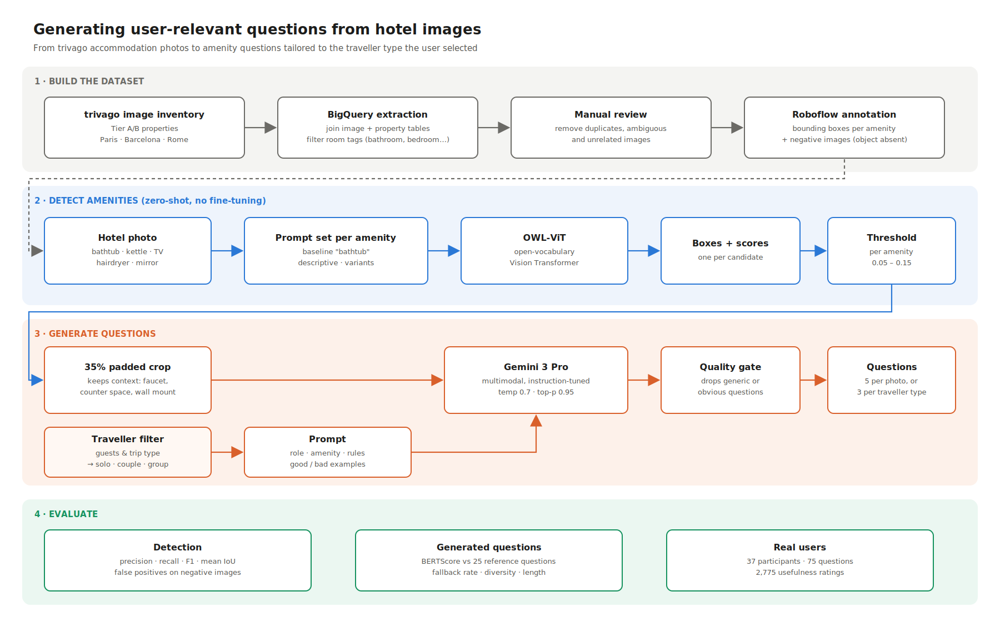
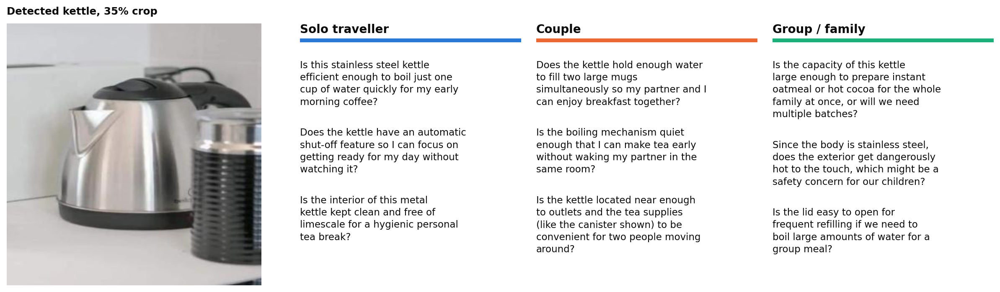

# Generating User-Relevant Questions from Hotel Images

Master's thesis project (M.Eng. Industrial Informatics, Hochschule Emden/Leer) in collaboration with **trivago N.V.**

A pipeline that finds amenities in accommodation photos and turns them into the questions a traveller would ask before booking, tailored to who is travelling: solo, as a couple, or as a group or family.

## The problem

Travellers scroll through dozens of photos per hotel, and the details that decide a booking (a proper bathtub, a kettle, a TV you can stream on) sit inside those photos without being pointed out. Nothing on the page tells users what to look for or what to ask, and every traveller cares about different things.

## What I built

1. **Dataset** from trivago's image inventory: BigQuery extraction for Tier A/B properties in Paris, Barcelona and Rome, manual review, and bounding-box annotation in Roboflow for five amenities (bathtub, kettle, TV, hairdryer, mirror), plus negative images.
2. **Zero-shot detection** with OWL-ViT, with no training. I compared prompt styles and a confidence-threshold sweep per amenity.
3. **Context-preserving crops:** each detection is padded by 35%, so the model sees the amenity and what is around it.
4. **Question generation** with Gemini 3 Pro on Vertex AI, reached after trying Flan-T5 and BLIP-2. There are two modes: five general questions per photo, or three questions each for a solo traveller, a couple and a group, matching the guest and trip-type filters on the search page.
5. **Evaluation** at every stage: detection metrics, BERTScore against real traveller questions, a rule-based quality gate, diversity and length checks, and a user study with 37 participants.

## Example

One detected kettle, three kinds of traveller:

## Key results

**Detection** (OWL-ViT, zero-shot, best prompt per amenity)

| Amenity | Prompt | Threshold | Precision | Recall | F1 |
|---|---|---|---|---|---|
| TV | "tv" | 0.05 | 0.81 | 0.78 | **0.79** |
| Bathtub | "bathtub" | 0.05 | 0.68 | 0.87 | **0.76** |
| Hairdryer | variants | 0.15 | 0.78 | 0.73 | **0.76** |
| Kettle | "electric kettle" | 0.05 | 0.73 | 0.66 | **0.69** |
| Mirror | "mirror" | 0.15 | 0.53 | 0.68 | **0.60** |

Descriptive prompts never helped: the long prompt was the weakest option for four amenities and tied for kettle. Low thresholds (0.05 to 0.15) beat the usual defaults everywhere.

**Question generation**
- Gemini 3.0 Pro had the highest similarity to real traveller questions (BERTScore 0.707) and the lowest fallback rate (**7.85%** of 7,770 questions).
- Profile-conditioned questions clearly differ by traveller type (distinctiveness 0.50 to 0.73) and need fallbacks in only 0 to 5% of cases.
- The five questions per photo cover different concerns (semantic diversity 0.71), and 93% are 10 to 20 words long.

**User study** (37 participants, 75 questions, 2,775 ratings)
- Mean usefulness **3.36 / 5**, with **49.6%** of ratings at 4 or 5.
- **Two thirds** would find a "smart question" feature useful on a booking site.
- The best-rated questions are the ones the photo can actually support: condition, streaming, sockets, a separate shower.

What this means for the product, and how I would test it live: [BUSINESS_CASE.md](BUSINESS_CASE.md)

## Repository

| Where | What |
|---|---|
| [`notebooks/`](notebooks) | The full walkthrough, one notebook per stage, with saved outputs |
| [`01_data_and_amenities`](notebooks/01_data_and_amenities.ipynb) | Sourcing, amenity selection, annotation, negatives |
| [`02_detection_owlvit`](notebooks/02_detection_owlvit.ipynb) | Prompt sets, threshold sweep, prompt comparison, false detections |
| [`03_cropping`](notebooks/03_cropping.ipynb) | 35% padding and why |
| [`04_question_generation`](notebooks/04_question_generation.ipynb) | Flan-T5 to BLIP-2 to Gemini, prompt design, model comparison, quality gate |
| [`05_profile_conditioning`](notebooks/05_profile_conditioning.ipynb) | Solo / couple / group questions and how distinct they are |
| [`06_question_quality`](notebooks/06_question_quality.ipynb) | Diversity and length |
| [`07_user_study`](notebooks/07_user_study.ipynb) | Study design, ratings, best and worst questions, feedback |
| [`src/amenity_qgen/`](src/amenity_qgen) | Detection, scoring, cropping, prompts, generation, quality checks |
| [`results/`](results) | Detections, generated questions, metrics, survey responses, figures |
| [`docs/`](docs) | Design diagram, BigQuery queries, defence slides |
| [`data/`](data) | Image sample per amenity, user-study photos, test annotations |

**Stack:** Python, BigQuery, Roboflow, PyTorch, Hugging Face Transformers (OWL-ViT), Gemini on Vertex AI, sentence-transformers, BERTScore, pandas, matplotlib.

## Notes

This is a showcase version. The full pipeline ran on trivago's internal data and cloud setup. The notebooks include saved outputs, a small image sample and the complete result files, and rebuild every table and chart from those files.

Images are provided by trivago N.V. and remain its property.
